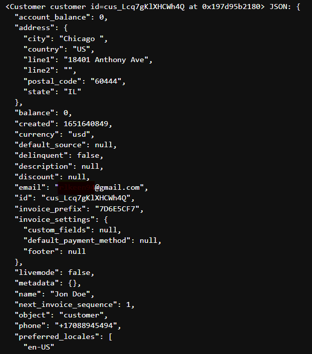

# Stripe
Strip payments platform in python code


------------------------------------------------------------

## Installation

You don't need this source code unless you want to modify the package. If you just want to use the package, just run: `pip install --upgrade stripe`

Install from source with: `python setup.py install`

## Requirements
Python 2.7+ or Python 3.4+ (PyPy supported)

## Usage

The library needs to be configured with your account's secret key which is available in your Stripe Dashboard. Set `stripe.api_key to its value`
```
import stripe
stripe.api_key = "sk_test_..."

# list customers
customers = stripe.Customer.list()

# print the first customer's email
print(customers.data[0].email)

# retrieve specific Customer
customer = stripe.Customer.retrieve("cus_123456789")

# print that customer's email
print(customer.email)
```
Unsuccessful requests raise exceptions. The class of the exception will reflect the sort of error that occurred. Please see the [Api Reference](https://stripe.com/docs/api/errors/handling) for a description of the error classes you should handle, and for information on how to inspect these errors.

## Per-request Configuration
Configure individual requests with keyword arguments. For example, you can make requests with a specific [Stripe Version](https://stripe.com/docs/api/versioning) or as a [connected account](https://stripe.com/docs/connect/authentication#authentication-via-the-stripe-account-header):
``````
import stripe

# list customers
stripe.Customer.list(
    api_key="sk_test_...",
    stripe_account="acct_...",
    stripe_version="2019-02-19"
)

# retrieve single customer
stripe.Customer.retrieve(
    "cus_123456789",
    api_key="sk_test_...",
    stripe_account="acct_...",
    stripe_version="2019-02-19"
)
````````
-------------------------------------
# Exicution Results

